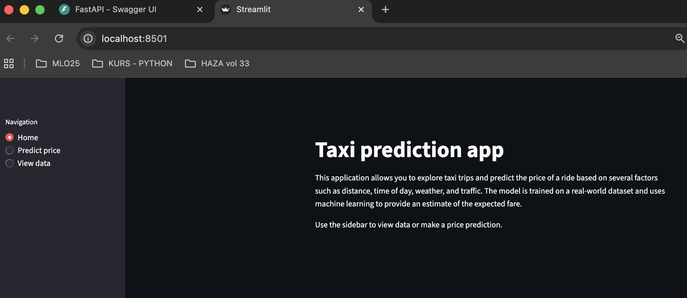
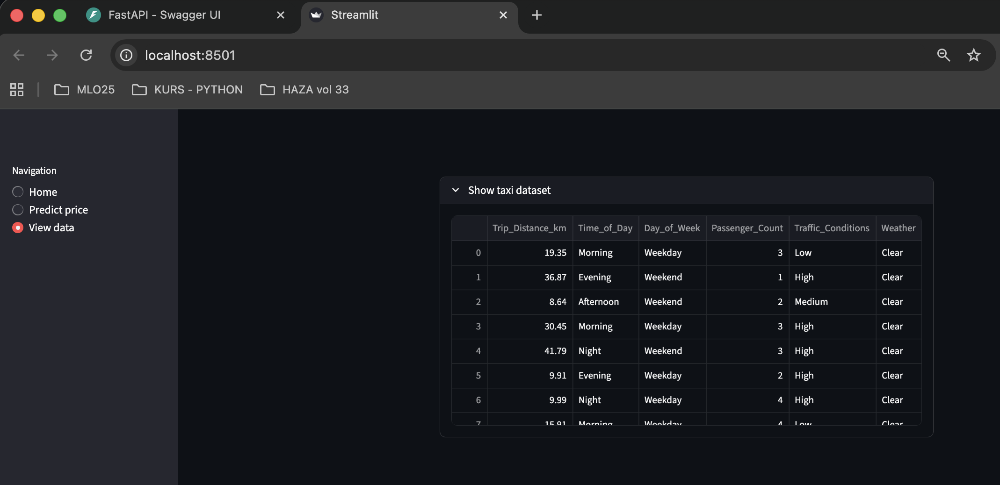
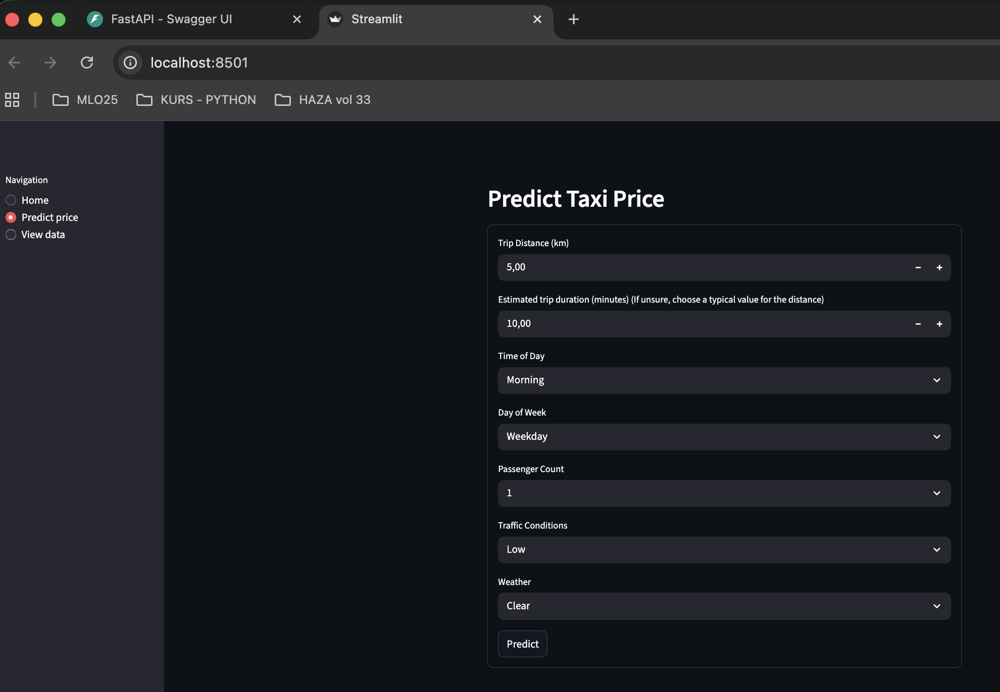
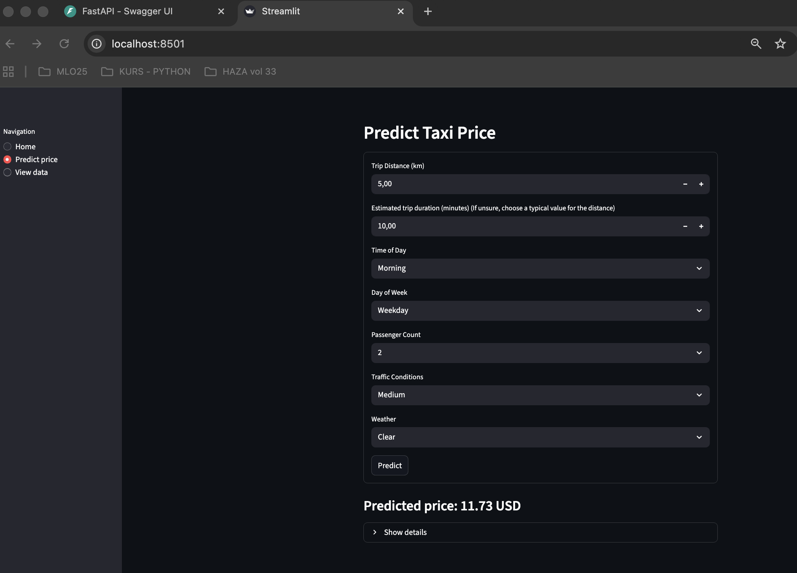

# Taxi-prediction-fullstack-haza
Machine Learning

This project is a fullstack application that predicts taxi prices based on several different factors such as distance, time of day, weather, and traffic.

**The application consists of:**
- Backend (FastAPI) – serves data and handles predictions
- Machine Learning model – trained on taxi data
- Frontend (Streamlit) – where the user can view the dataset and test predictions

**EDA & Data Cleaning**
The following steps were performed in Jupyter Notebook:
- Dataset analysis
- Handling missing values
- Removing outliers
- Selecting relevant features

The cleaned data was exported to `final_data.csv`.

**Machine Learning Model**
Several models were tested (Linear Regression, KNN, Random Forest).
Linear Regression achieved the best results and was selected as the final model.

The trained model was saved as `final_model.joblib`.

Random Forest was selected as it gave the best results.  
The trained model was saved as `final_model.joblib`.

**Backend – FastAPI**
The backend loads the ML model and provides two endpoints:
- **GET /taxi/data** – returns cleaned taxi data
- **POST /taxi/predict** – receives user input and returns a calculated taxi price

Used by the frontend to fetch data and make predictions.

**Frontend – Streamlit**
The application consists of three pages:
- **Home** – shows a short introduction and instructions on how to use the app
- **View data** – displays the cleaned taxi data in table format directly from the backend
- **Predict Taxi Price** – a form where the user enters trip details and gets a predicted taxi price.  
  A "Show details" box displays which values were sent to the model.

The frontend communicates with the backend via HTTP.

---

## Application Screenshots

### Home


### View data


### Predict Taxi Price


### Prediction result


---

## Start application

Start API:
```bash
backend % uv run uvicorn api:app --reload

frontend % streamlit run app.py
